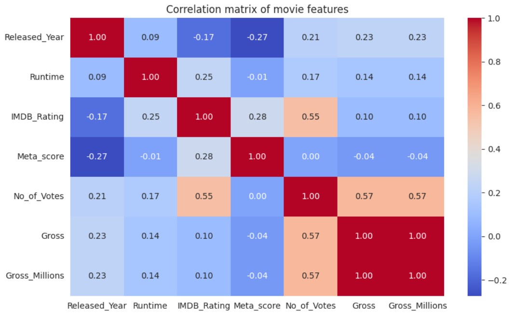
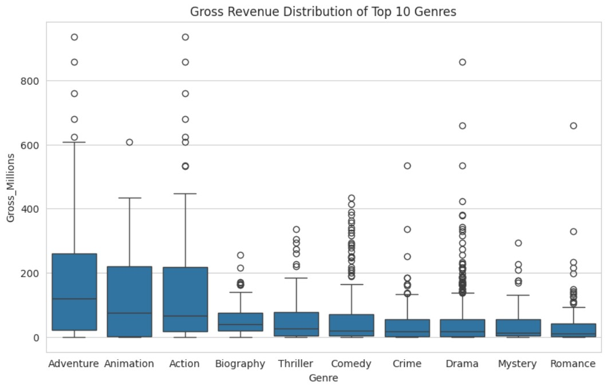
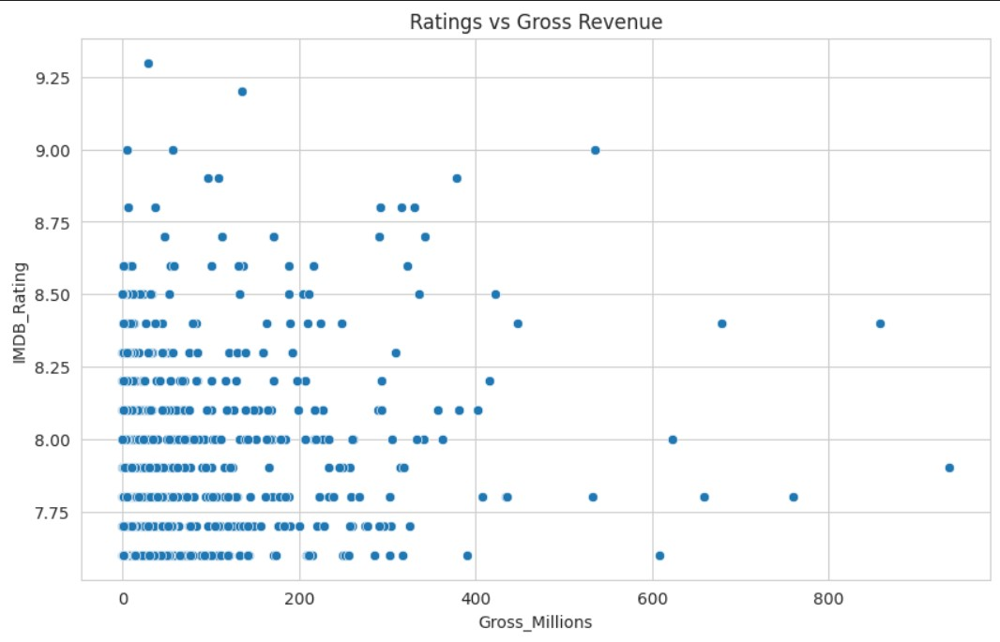

# IMDb Top 1000 Movies: Data Analysis


> Uncovering what drives movie success: Why high ratings don't guarantee box office profits

## Key Insights

| Finding | Insight |
|---------|---------|
| Revenue ≠ Ratings | Only 0.1 correlation between IMDB rating and gross |
| Drama Paradox | Most common genre but lowest median earnings |
| Safe Bets | Animation & Adventure have highest median gross |

## Featured Visualizations

### Correlation Heatmap


### Genre Revenue Distribution  


### Ratings vs Revenue


## Skills Demonstrated
- Data cleaning & preprocessing
- Statistical analysis & correlation studies
- Data visualization with Matplotlib/Seaborn
- Feature engineering (created 4 derived columns)

## Project Structure

```text
├── data/
│   ├── imdb_top_1000.csv          # Raw dataset
│   └── cleaned_imdb_top_1000.csv  # Cleaned dataset
├── notebooks/
│   └── imdb_eda.ipynb             # Main analysis notebook
├── reports/
│   └── analysis_summary.md        # Detailed findings report
├── images/                        # Visualizations for README
├── README.md
└── requirements.txt
```

## How to run locally
1. Clone the repository
```bash
git clone https://github.com/rahulkrishna-s/imdb-eda-notebooks.git
cd imdb-eda-notebooks
```
2. Install dependencies
```
pip install -r requirements.txt
```
3. Open the notebook
```
jupyter notebook notebooks/imdb_eda.ipynb
```